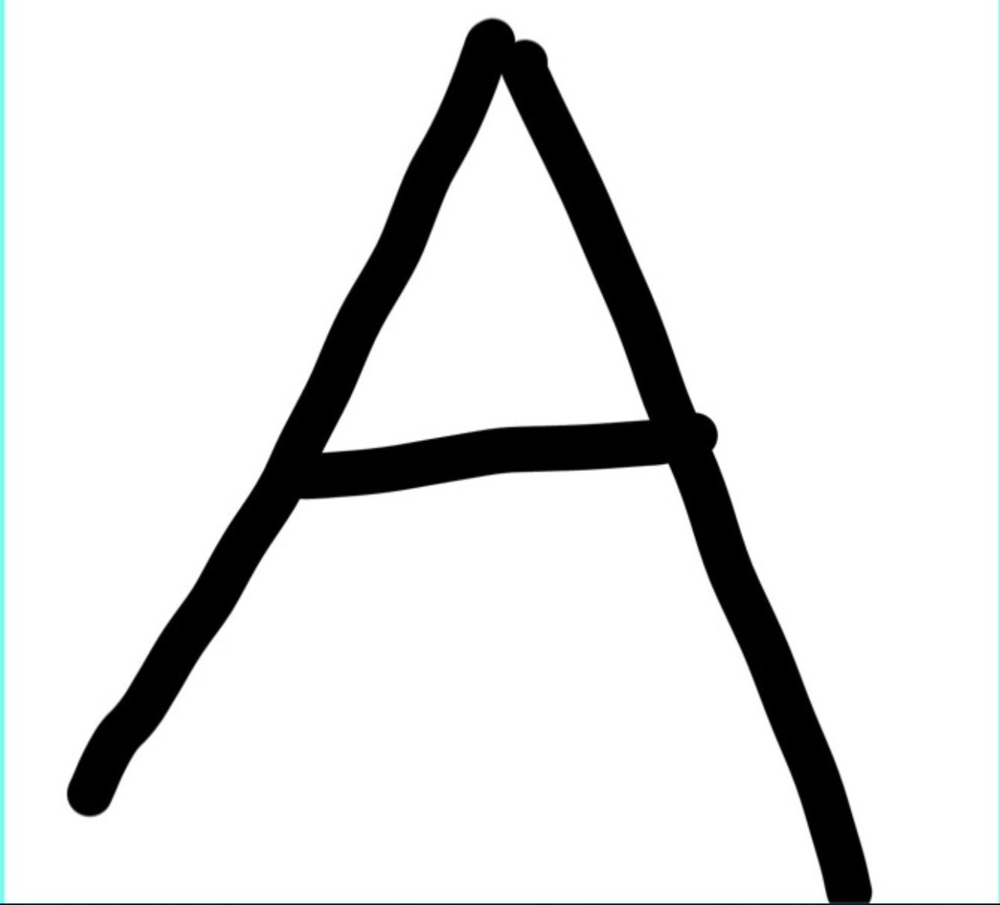
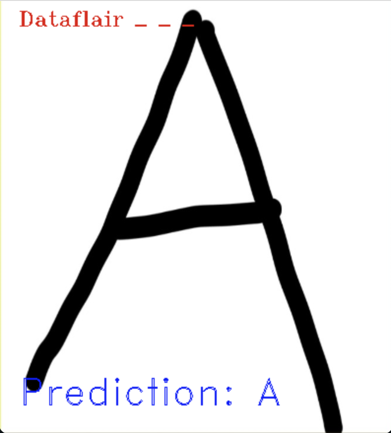
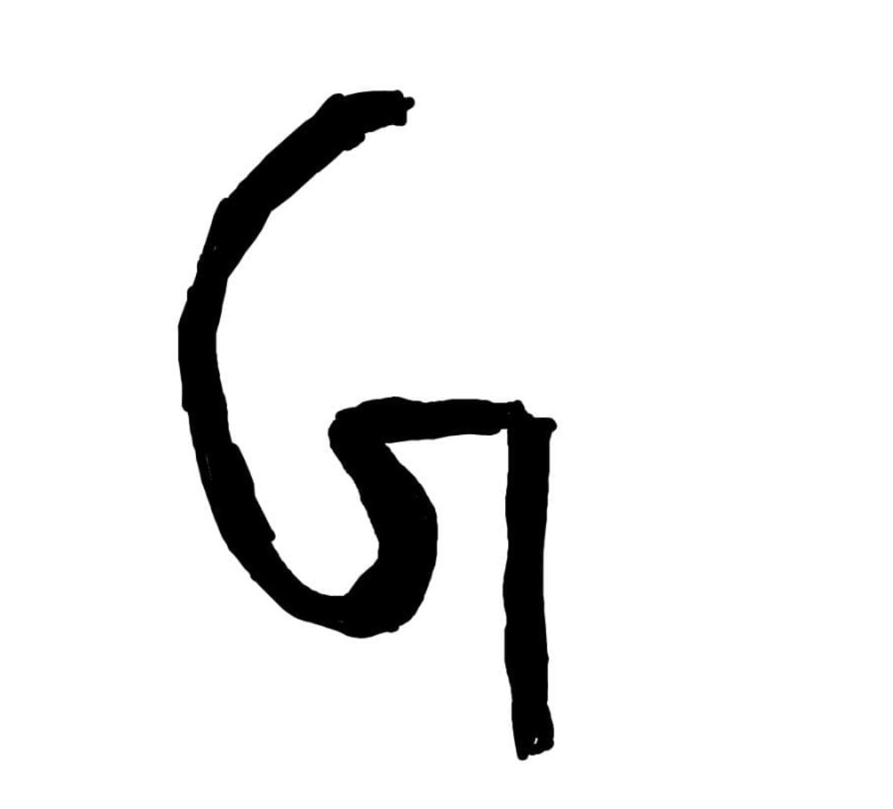
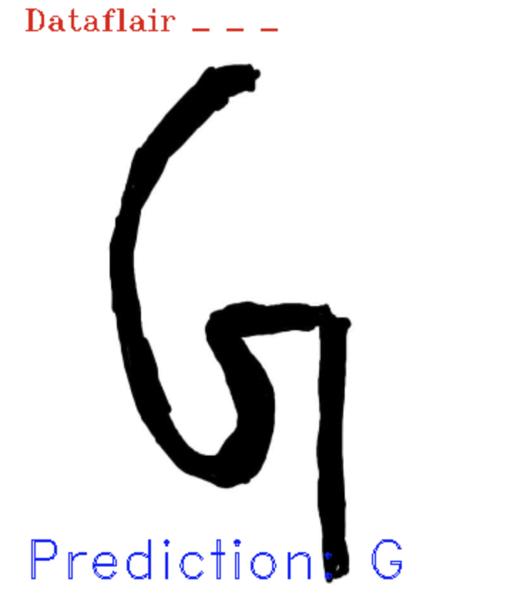
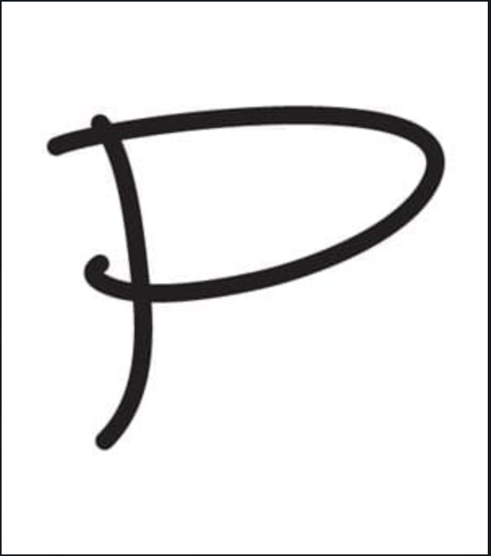
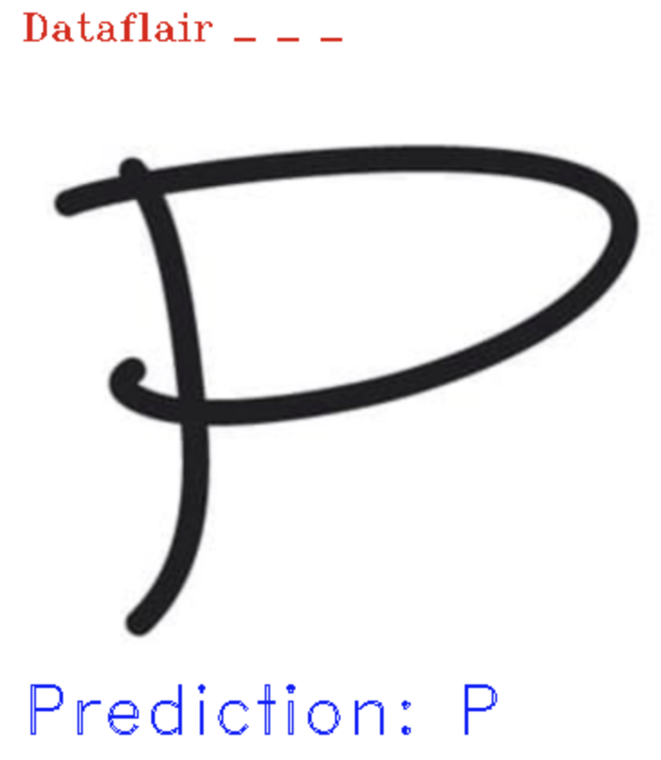
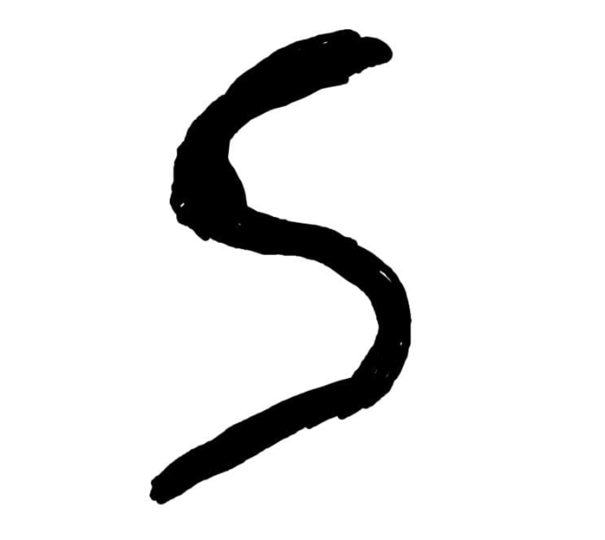
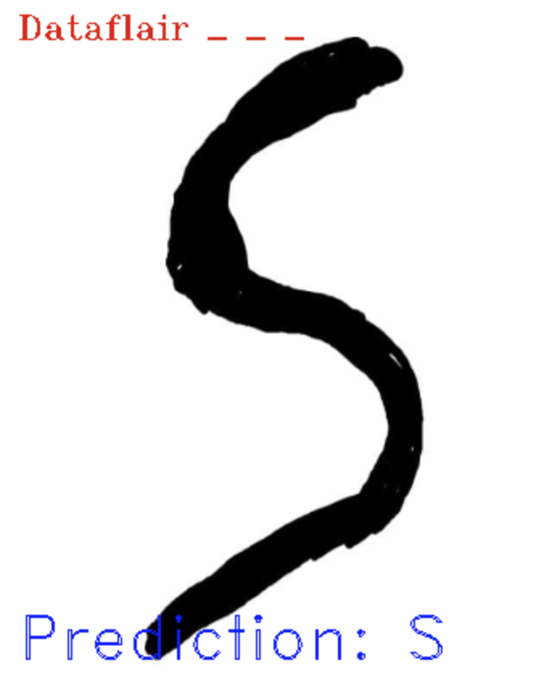

# Hand Written Character Recognition
## Steps To Run :
1. Install dependancies 
2. Download DataSet From kaggle and copy the path in code.
3. Try to copy path of image in the code to test for the prediction
4. Done
## Link To DataSet :

https://www.kaggle.com/sachinpatel21/az-handwritten-alphabets-in-csv-format 

## Output:

### Test Case 1 : A

Input: 

Output: 

### Test Case 1 : G

Input: 

Output: 

### Test Case 1 : P

Input: 

Output: 

### Test Case 1 : S

Input: 

Output: 

